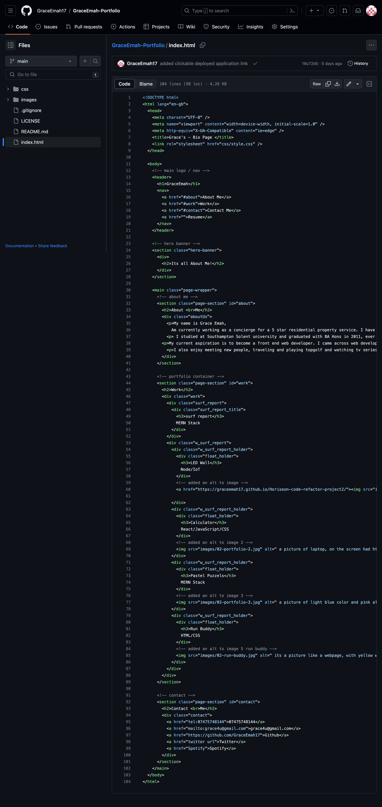

GRACEEMAH Portfolio

Welcome to my personal portfolio website! This project is a representation of my skills, experience, and passion for front-end developer Whether you're a potential employer, colleague, or just curious about my work, I'm excited to share my journey with you.

Table of Contents
About Me
Projects
Skills
Deployed link
screenshoot image

About Me
In this section, you'll get to know more about who I am, my background, and what drives me in the world of front-end developemnt. I believe in personal philosophy or approach and have a deep passion of developing web application and seeing it come to life.

Projects

This week challenge was for me to create a portfolio project on a bio webpage about myself. I created this using html for the structure of the portfolio web page and css to style it. 
Ensuring the page looks like the mockup for the for challenge which was given, including the images and sizes.

[Project - Horiseon-code-refactor2]
git@github.com:GraceEmah17/Horiseon-code-refactor-project2.git

This project was about a marketing company that wanted to make their webpage better by ensuring site is optimized for search engines. This was achieved by making sure i gave the it an identity for it to be clickable. A short discription of all images were added to using an alt atribte to it. 
The technologies used for this project was html and css to style the page. 

Skills
I have demostrated my skills for this portfolio by using wireframe for the layout of the page. Ensuring the pictures are the correct sizes as the mockup, and the site is optimized for the search engine and beautified the page with my css, ensuring the right colors are used, such as font colors, background colors, sizes etc. 

This is the link to my deployed application git@github.com:GraceEmah17/GraceEmah-Portfolio.git
Below is a screenshoot of my html code. 

